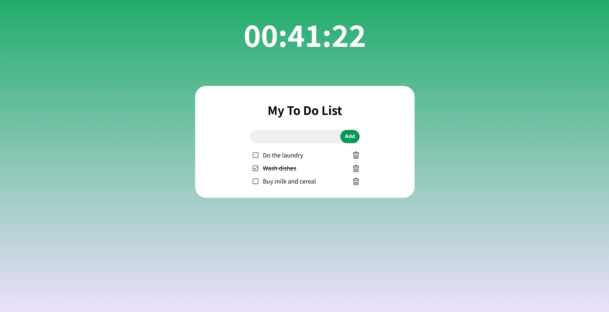

# To-Do List Web App with Clock

This is a simple **To-Do List Web App** built using **HTML**, **CSS**, and **JavaScript**. The app allows users to add, mark as completed, and delete tasks, with data persistence using the browser's localStorage. Additionally, the application includes a **real-time clock** displayed at the top of the interface, enhancing usability and aesthetic appeal. The UI design is sleek and visually engaging, featuring a gradient background that makes it an **excellent choice as a browser homepage**, combining both functionality and aesthetics.

## Features

- **Add Tasks:** Input tasks through a form and add them to the list.
- **Mark as Completed:** Click on a task to toggle its completed status.
- **Delete Tasks:** Remove tasks using a delete button.
- **Data Persistence:** Tasks are saved to localStorage and reloaded upon revisiting the page.
- **Real-Time Clock:** A live clock is displayed at the top, providing constant time updates.
- **Elegant UI Design:** The app features a gradient background and polished elements, making it visually appealing.

## Demo



## Installation

1. Clone this repository:  
   ```bash
   git clone https://github.com/yourusername/todo-app.git
   ```
2. Open `index.html` in your browser.

## Usage

- Enter a task in the input field and click **"Add"** to add it to the list.
- Click on a task to mark it as completed or uncompleted.
- Use the delete button to remove a task.
- Enjoy the real-time clock and the visually appealing gradient background.
- Set it as your browser homepage for a functional and elegant start to your browsing experience.

## Acknowledgments

This project was inspired by the tutorial **"【3小時JavaScript課程】從零基礎到開發第一個應用"** by **走歪的工程師James**. The majority of the code and concepts used here (approximately 80-90%) are based on James' tutorial. You can find [the original tutorial](https://www.youtube.com/watch?v=vDNw0FWL8zw) on [his YouTube channel](https://www.youtube.com/@james-kool).

Additionally, this project marks my **first experience learning web development**. Through this journey, I gained hands-on experience with creating sound user interfaces with CSS and HTML, managing user interactions with JavaScript, and implementing persistent data storage using localStorage. It was a rewarding process that solidified my interest in building practical applications.

---

Thank you for using this application! Feel free to customize it further or suggest improvements.
